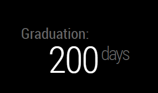

# MagicMirror Module: MMM-CountDown

A MagicMirror Module for displaying down the days to a date/event.

[](https://MagicMirror.builders)

## Example



I've never written anything with Node.js before, so hopefully this isn't a total mess, if it is - feel free to lend a hand :)

## Using the module

To use this module, add the following configuration block to the modules array in the `config/config.js` file:

```js
var config = {
    modules: [
        {
            module: 'MMM-CountDown',
            config: {
                // See configuration options
            }
        }
    ]
}
```

## Configuration options

| Option           | Description                                                                                                           |
| ---------------- | --------------------------------------------------------------------------------------------------------------------- |
| `position`       | *Required* Where do you want to place the counter (use standard magicmirror positions)                                |
| `event`          | *Required* Name of event to count down to (displayed above counter)                                                   |
| `date`           | *Required* Date to count down to (YYYY-MM-DD HH:MM:SS)                                                                |
| `showHours`      | Decide whether or not to display the hours. Default is true                                                           |
| `showMinutes`    | Decide whether or not to display the minutes. Default is true                                                         |
| `showSeconds`    | Decide whether or not to display the seconds. Default is true                                                         |
| `customInterval` | Change the update interval which will help reduce load if you are only showing specific time metrics. Default is 1000 |
| `daysLabel`      | Choose how you wish to display your Days label. Default is d                                                          |
| `hoursLabel`     | Choose how you wish to display your Hours label. Default is h                                                         |
| `minutesLabel`   | Choose how you wish to display your Minutes label. Default is m                                                       |
| `secondsLabel`   | Choose how you wish to display your Seconds label. Default is m                                                       |

If either of the above are missing, the module will count down to the New Millenium (3000-01-01)
