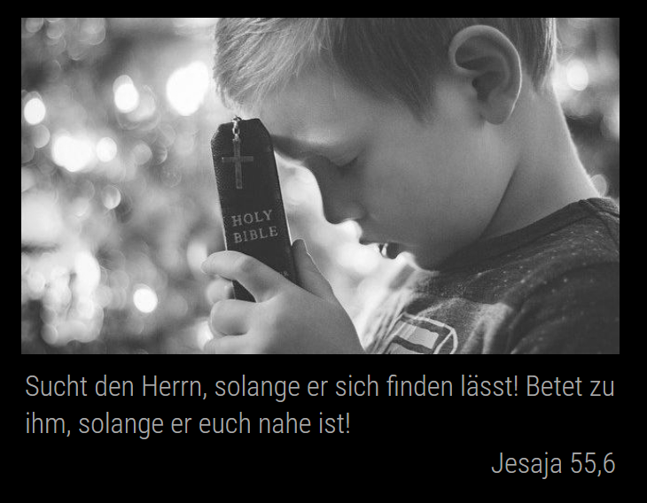

# MagicMirror Module: MMM-DailyPower

A MagicMirror Module for displaying the daily bible verse from [DailyPower](https://dailypower.de)

[](https://MagicMirror.builders)

## Example



## Installation
1. Go to `MagicMirror/modules`
2. Execute `git clone https://github.com/oemel09/MMM-DailyPower.git`

## Using the module
To use this module, add it to the modules array in the `config/config.js` file:
```
modules: [
    {
        module: "MMM-DailyPower",
        position: "top_left",       // This can be any region
        config: {
            // See 'Configuration options' for more information.
        }
    }
]
```

## Configuration options
The following properties can be configured:

| Option            | Default       | Description
| ----------------- | ------------- | ----------- 
| `width`           | `75%`         | Configure the width of this widget
| `margin`          | `0 auto`      | Add margin to the widget
| `translation`     | `de`          | Set the bible translation, see 'available translations'
| `verseColor`      | `#ccc`        | Color of the verse
| `verseSize`       | `28px`        | Size of the verse
| `referenceColor`  | `#ccc`        | Color of the reference
| `referenceSize`   | `32px`        | Size of the reference 
| `showImage`       | `true`        | Display an image for the daily verse or keep the space
| `blackAndWhite`   | `true`        | Black and White image or keep the colors

## Available translations
This page lists all available translations: https://dailypower.de/api/v1/translations

Use the `code` as the `translation` in the config.

## Credits
- Translations are powered by: https://getbible.net/
- Pictures are from: https://pixabay.com/
- MagicMirror: https://github.com/MichMich/MagicMirror/
