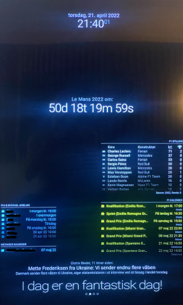

# MyMagicMirror
MyMagicMirror

[](https://MagicMirror.builders)
[](https://github.com/The-Exterminator/MyMagicMirror)

Start the install with this :

```
bash -c "$(curl -s https://raw.githubusercontent.com/The-Exterminator/MyMagicMirror/main/install-MyMagicMirror.sh)"
```
**If you have problems with a module, click on the link under "MMM-Name" or "Link to MMM Module"**</br>
**You can see my code under "My config.js" by clicking on the link**

|Page|MMM-Name|Link to MMM Module|My config.js|
|:-:|---|---|---|
|All|[`clock`](https://docs.magicmirror.builders/modules/clock.html)|[MichMich](https://github.com/MichMich/MagicMirror/tree/master/modules/default/clock)|[Insert This](#clock)|
|All|[`MMM-GroveGestures`](/MMM-GroveGestures/README.md)|[eouia](https://github.com/eouia/MMM-GroveGestures)|[Insert This](#mmm-grovegestures)|
|All|[`MMM-MagicMirrorCompliments`](MMM-MagicMirrorCompliments/README.md)|[The-Exterminator](MMM-MagicMirrorCompliments)|[Insert This](#mmm-magicmirrorcompliments)|
|All|[`MMM-page-indicator`](/MMM-page-indicator/README.md)|[edward-shen](https://github.com/edward-shen/MMM-page-indicator)|[Insert This](#mmm-page-indicator)|
|All|[`MMM-pages`](/MMM-pages/README.md)|[edward-shen](https://github.com/edward-shen/MMM-pages)|[Insert This](#mmm-pages)|
|All|[`MMM-Remote-Control`](/MMM-Remote-Control/README.md)|[Jopyth](https://github.com/Jopyth/MMM-Remote-Control)|[Insert This](#mmm-remote-control)|
| | | |
|1|[`MMM-DynamicWeather`](/MMM-DynamicWeather/README.md)|[scottcl88](https://github.com/scottcl88/MMM-DynamicWeather)|[Insert This](#mmm-dynamicweather)|
|1|[`MMM-NewsFeedBT`](https://docs.magicmirror.builders/modules/newsfeed.html)|[The-Exterminator](https://github.com/MichMich/MagicMirror/tree/master/modules/default/newsfeed)|[Insert This](#mmm-newsfeedbt)|
|1|[`MMM-WeatherOrNot`](/MMM-WeatherOrNot/README.md)|[mykle1](https://github.com/mykle1/MMM-WeatherOrNot)|[Insert This](#mmm-weatherornot)|
|1|[`updatenotification`](https://docs.magicmirror.builders/modules/updatenotification.html)|[MichMich](https://github.com/MichMich/MagicMirror/tree/master/modules/default/updatenotification)|[Insert This](#updatenotification)|
|1|[`weather`](https://docs.magicmirror.builders/modules/weather.html)|[MichMich](https://github.com/MichMich/MagicMirror/tree/master/modules/default/weather)|[Insert This](#weather)|
| | | |
|2|[`calendar  (Sync private iCloud calendar.)`](https://docs.magicmirror.builders/modules/calendar.html)|[beh](https://forum.magicmirror.builders/topic/5327/sync-private-icloud-calendar-with-magicmirror?page=1)|[Insert This](#calendar)|
|2|[`MMM-CountDown`](/MMM-CountDown/README.md)|[boazarad](https://github.com/boazarad/MMM-CountDown)|[Insert This](#mmm-countdown)|
|2|[`MMM-Formula1`](/MMM-Formula1/README.md)|[ianperrin](https://github.com/ianperrin/MMM-Formula1)|[Insert This](#mmm-formula1)|
|2|[`MMM-NewsFeedEB`](https://docs.magicmirror.builders/modules/newsfeed.html)|[The-Exterminator](https://github.com/MichMich/MagicMirror/tree/master/modules/default/newsfeed)|[Insert This](#mmm-newsfeedeb)|
| | | |
|3|[`MMM-DailyPower`](/MMM-DailyPower/README.md)|[oemel09](https://github.com/oemel09/MMM-DailyPower)|[Insert This](#mmm-dailypower)|
|3|[`MMM-NewsFeedTV2`](https://docs.magicmirror.builders/modules/newsfeed.html)|[The-Exterminator](https://github.com/MichMich/MagicMirror/tree/master/modules/default/newsfeed)|[Insert This](#mmm-newsfeedtv2)|
| | | |
|4|[`MMM-network-signal`](/MMM-network-signal/README.md)|[PoOwAa](https://github.com/PoOwAa/MMM-network-signal)|[Insert This](#mmm-network-signal)|
|4|[`MMM-NewsFeedBerlingske`](https://docs.magicmirror.builders/modules/newsfeed.html)|[The-Exterminator](https://github.com/MichMich/MagicMirror/tree/master/modules/default/newsfeed)|[Insert This](#mmm-newsfeedberlingske)|
|4|[`MMM-ServerStatus`](/MMM-ServerStatus/README.md)|[XBCreepinJesus](https://github.com/XBCreepinJesus/MMM-ServerStatus)|[Insert This](#mmm-serverstatus)|
|4|[`MMM-Tools`](/MMM-Tools/README.md)|[bugsounet](https://github.com/bugsounet/MMM-Tools)|[Insert This](#mmm-tools)|
| | | |

## Example
<p align="center">
  
   </br>
  
  

#

# All
## Clock
```
{
  module: 'clock',
  position: 'top_center',
  config: {}
}
```
#
## MMM-GroveGestures
```
{
  module: 'MMM-GroveGestures',
  position: 'bottom_left',
  config: {
    autoStart: true,
    verbose: true,
    recognitionTimeout: 1000,
    pythonPath: '/usr/bin/python3',
    commandSet: {
      default: {
        UP: {
          moduleExec: {
          module: []
          }
        },
        DOWN: {
          moduleExec: {
          module: []
          }
        },
        LEFT: {
          notificationExec: {
          notification: 'PAGE_DECREMENT',
          payload: null
          }
        },
        RIGHT: {
          notificationExec: {
          notification: 'PAGE_INCREMENT',
          payload: null
          }
        }
      }
    }
  }
}
```
**REMEMBER to adjust your settings in ~/MagicMirror/config/config.js**
#
## MMM-MagicMirrorCompliments
```
{
  module: 'compliments',
  position: 'bottom_bar',
  config: {
    remoteFile: 'dk-compliments.json'
  }
}
```
**REMEMBER to adjust your settings in ~/MagicMirror/config/config.js**
#
## MMM-page-indicator
```
{
  module: 'MMM-page-indicator',
  position: 'bottom_bar',
  config: {
    pages: 4,
    activeBright: true
  }
}
```
**REMEMBER to adjust your settings in ~/MagicMirror/config/config.js**
#
## MMM-pages
```
{
  module: 'MMM-pages',
  config: {
    rotationTime: 1800000,
      modules: [
        [
          'MMM-NewsFeedBT',
          'updatenotification',
          'weather',
          'MMM-DynamicWeather',
          'MMM-WeatherOrNot'
        ],
        [
          'MMM-NewsFeedEB',
          'MMM-Formula1',
	  'MMM-CountDown',
          'calendar'
        ],
        [
          'MMM-NewsFeedTV2',
          'MMM-DailyPower'
        ],
        [
          'MMM-NewsFeedBerlingske',
          'MMM-network-signal',
          'MMM-Tools',
          'MMM-ServerStatus'
        ]
      ],
      fixed: [
          'clock',
          'compliments',
          'MMM-page-indicator',
          'MMM-GroveGestures',
          'MMM-Remote-Control'
      ]
  }
}
```
**REMEMBER to adjust your settings in ~/MagicMirror/config/config.js**
#
## MMM-Remote-Control
```
{
  module: 'MMM-Remote-Control',
  config: {}
}
```
**REMEMBER to adjust your settings in ~/MagicMirror/config/config.js**
#

# Page 1
## MMM-DynamicWeather
```
{
  module: 'MMM-DynamicWeather',
  position: 'fullscreen_above',
  config: {
    locationID: '2624341',
    api_key: 'YOUR_OPENWEATHER_API_KEY',
    weatherInterval: 300000
  }
}
```
**REMEMBER to adjust your settings in ~/MagicMirror/config/config.js**
#
## MMM-NewsFeedBT
```
{
  module: 'MMM-NewsFeedBT',
  position: 'bottom_bar',
  config: {
    feeds: [
      {
        title: 'BT',
        url: 'https://www.bt.dk/bt/seneste/rss'
      }
    ]
  }
}
```
**REMEMBER to adjust your settings in ~/MagicMirror/config/config.js**
#
## MMM-WeatherOrNot
```
{
  module: 'MMM-WeatherOrNot',
  position: 'bottom_left',
  header: '',
  config: {
    location: 'ballerup',
    locationCode: '55d7212d35',
    languages: 'da',
    tempUnits: 'C',
    font: 'Tahoma',
    textColor: '#eeeeee',
    htColor: '#ffffff',
    ltColor: '#d7d7d7',
    sunColor: '#de792d',
    moonColor: '#eeeeee',
    cloudColor: '#dfdede',
    cloudFill: '#323232',
    rainColor: '#8bc1e5',
    snowColor: '#ffffff',
    height: '210px',
    width: '335px',
    label2: 'Ballerup',
    days: '7',
    theme: 'dark',
    bgColor: '#000000',
    icons: 'Climacons Animated',
    updateInterval: 600000
  }
}
```
**REMEMBER to adjust your settings in ~/MagicMirror/config/config.js**
#
## Updatenotification
```
{
  module: 'updatenotification',
  position: 'top_bar',
  config: {}
}
```
#
## Weather
```
{
  module: 'weather',
  position: 'bottom_left',
  header: 'Ballerup',
  config: {
    location: 'Ballerup',
    locationID: '2624341',
    apiKey: 'YOUR_OPENWEATHER_API_KEY',
    showHumidity: true,
    initialLoadDelay: 1500
  }
}
```
**REMEMBER to adjust your settings in ~/MagicMirror/config/config.js**
#

# Page 2
## Calendar
```
{
  module: 'calendar',
  header: 'INSERT YOURS HERE',
  position: 'bottom_left',
  timeFormat: 24,
  config: {
    dateFormat: 'DD MMM YY HH:mm',
    dateEndFormat: 'HH:mm',
    fullDayEventDateFormat: 'DD MMM YY',
    colored: true,
    showLocation: true,
    maximumNumberOfDays: 90,
    maximumEntries: 7,
      calendars: [
        {
          symbol: 'calendar',
          url: 'http://localhost:8080/modules/calendars/INSERT-YOURS-HERE.ics',
          color: '#5bc0de'
        }
      ]
  }
}
```
**REMEMBER to adjust your settings in ~/MagicMirror/config/config.js**
#
## MMM-CountDown
```
{
  module: 'MMM-CountDown',
  position: "upper_third",
  config: {
    position: "upper_third",
	  event: "Le Mans 2022 om:",
	  date: "2022-06-11 16:00:00",
	  showHours: true,
	  showMinutes: true,
	  showSeconds: true,
	  customInterval: 1000,
	  daysLabel: 'd',
	  hoursLabel: 't',
	  minutesLabel: 'm',
	  secondsLabel: 's',
  }
}
```
**REMEMBER to adjust your settings in ~/MagicMirror/config/config.js**
#
## MMM-Formula1
```
{
  module: 'MMM-Formula1',
  position: 'bottom_right',
  header: 'F1 Stilling',
  config: {
    season: "current",
	  type: "DRIVER",
	  maxRows: 10,
	  calendar: false,
	  showConstructor: true,
	  fade: true,
	  fadePoint: 0.3,
	  reloadInterval: 1800000,
	  animationSpeed: 2500,
	  grayscale: true,
	  showFooter: true
  }
},
{
  module: 'calendar',
  header: 'F1 Kalender',
  position: 'bottom_right',
  timeFormat: 24,
  config: {
    dateFormat: 'DD MMM YY HH:mm',
    dateEndFormat: 'HH:mm',
    fullDayEventDateFormat: 'DD MMM YY',
    colored: true,
    showLocation: true,
    maxRows: 10,
    maximumNumberOfDays: 90,
    maximumEntries: 7,
      calendars: [
        {
          symbol: 'calendar-check',
          url: 'webcal://www.f1calendar.com/download/da/f1-calendar_q_gp.ics?t=1639502383059',
          color: '#FFF000'
        }
      ]
  }
}
```
**REMEMBER to adjust your settings in ~/MagicMirror/config/config.js**
#
## MMM-NewsFeedEB
```
{
  module: 'MMM-NewsFeedEB',
  position: 'bottom_bar',
  config: {
    feeds: [
      {
        title: 'Ekstra Bladet',
        url: 'https://ekstrabladet.dk/rssfeed/nyheder/'
      }
    ]
  }
}
```
**REMEMBER to adjust your settings in ~/MagicMirror/config/config.js**
#

# Page 3
## MMM-DailyPower
```
{
  module: 'MMM-DailyPower',
  position: 'middle_center',
  config: {
    translation: 'danish',
    blackAndWhite: false
  }
}
```
**REMEMBER to adjust your settings in ~/MagicMirror/config/config.js**
#
## MMM-NewsFeedTV2
```
{
  module: 'MMM-NewsFeedTV2',
  position: 'bottom_bar',
  config: {
    feeds: [
      {
        title: 'TV2 Lorry',
        url: 'https://www.tv2lorry.dk/rss'
      }
    ]
  }
}
```
**REMEMBER to adjust your settings in ~/MagicMirror/config/config.js**
#

# Page 4
## MMM-Network-Signal
```
{
  module: 'MMM-network-signal',
  position: 'top_right',
  config: {
    animationSpeed: 100,
    showMessage: false
  }
}
```
**REMEMBER to adjust your settings in ~/MagicMirror/config/config.js**
#
## MMM-NewsFeedBerlingske
```
{
  module: 'MMM-NewsFeedBerlingske',
  position: 'bottom_bar',
  config: {
    feeds: [
      {
        title: 'Berlingske',
        url: 'https://www.berlingske.dk/content/21838/rss'
      }
    ]
  }
}
```
**REMEMBER to adjust your settings in ~/MagicMirror/config/config.js**
#
## MMM-ServerStatus
```
{
  module: 'MMM-ServerStatus',
  position: 'top_left',
  header: 'Raspberry',
  config: {
    templateName: 'MyTemplate',
    group: 'raspberry',
      hosts: [
        {
          name: 'WebServer',
          ip: 'INSERT YOURS HERE'
        },
        {
          name: 'SQLServer',
          ip: 'INSERT YOURS HERE'
        },
        {
          name: 'Transmission',
          ip: 'INSERT YOURS HERE'
        },
        {
          name: 'Lejepladsen',
          ip: 'INSERT YOURS HERE'
        },
        {
          name: 'Airsonic',
          ip: 'INSERT YOURS HERE'
        }
      ],
    pingInterval: 10,
    loadDelay: 5,
    upSymbol: 'server',
    upColor: 'green',
    upText: 'er online',
    downSymbol: 'server',
    downColor: 'red',
    downText: 'er offline'
  }
},
{
  module: 'MMM-ServerStatus',
  position: 'top_left',
  header: 'Hvem er hjemme',
  config: {
    templateName: 'MyTemplate',
    group: 'mobil',
      hosts: [
        {
          name: 'My Boy',
          ip: 'INSERT YOURS HERE'
        },
        {
          name: 'Me',
          ip: 'INSERT YOURS HERE'
        }
      ],
    pingInterval: 10,
    loadDelay: 10,
    upSymbol: 'mobile-alt',
    upColor: 'green',
    upText: 'er hjemme',
    downSymbol: 'mobile-alt',
    downColor: 'red',
    downText: 'er ikke hjemme'
  }
},
{
  module: 'MMM-ServerStatus',
  position: 'top_left',
  header: 'TV',
  config: {
    templateName: 'MyTemplate',
    group: 'TV',
      hosts: [
        {
          name: 'My Boy',
          ip: 'INSERT YOURS HERE'
        },
        {
          name: 'Me',
          ip: 'INSERT YOURS HERE'
        },
      ],
    pingInterval: 10,
    loadDelay: 15,
    upSymbol: 'tv',
    upColor: 'green',
    upText: 'ser tv',
    downSymbol: 'tv',
    downColor: 'red',
    downText: 'ser ikke tv'
  }
},
{
  module: 'MMM-ServerStatus',
  position: 'top_left',
  header: 'Playstation',
  config: {
    templateName: 'MyTemplate',
    group: 'Playstation',
      hosts: [
        {
          name: 'My Boy',
          ip: 'INSERT YOURS HERE'
        },
        {
          name: 'Me',
          ip: 'INSERT YOURS HERE'
        }
      ],
    pingInterval: 10,
    loadDelay: 20,
    upSymbol: 'arrow-alt-circle-up',
    upColor: 'green',
    upText: 'spiller',
    downSymbol: 'arrow-alt-circle-down',
    downColor: 'red',
    downText: 'spiller ikke'
  }
}
```
**REMEMBER to adjust your settings in ~/MagicMirror/config/config.js**
#
## MMM-Tools
```
{
  module: 'MMM-Tools',
  position: 'bottom_left',
  config: {}
}
```
**REMEMBER to adjust your settings in ~/MagicMirror/config/config.js**
#
